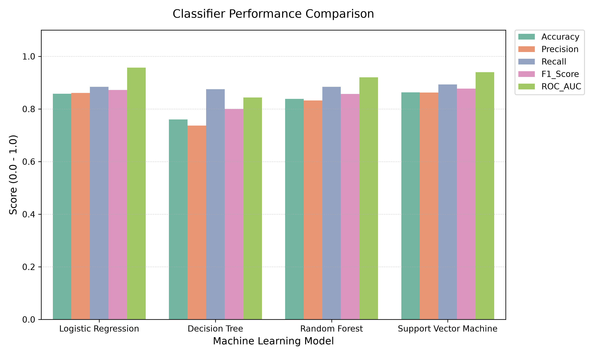
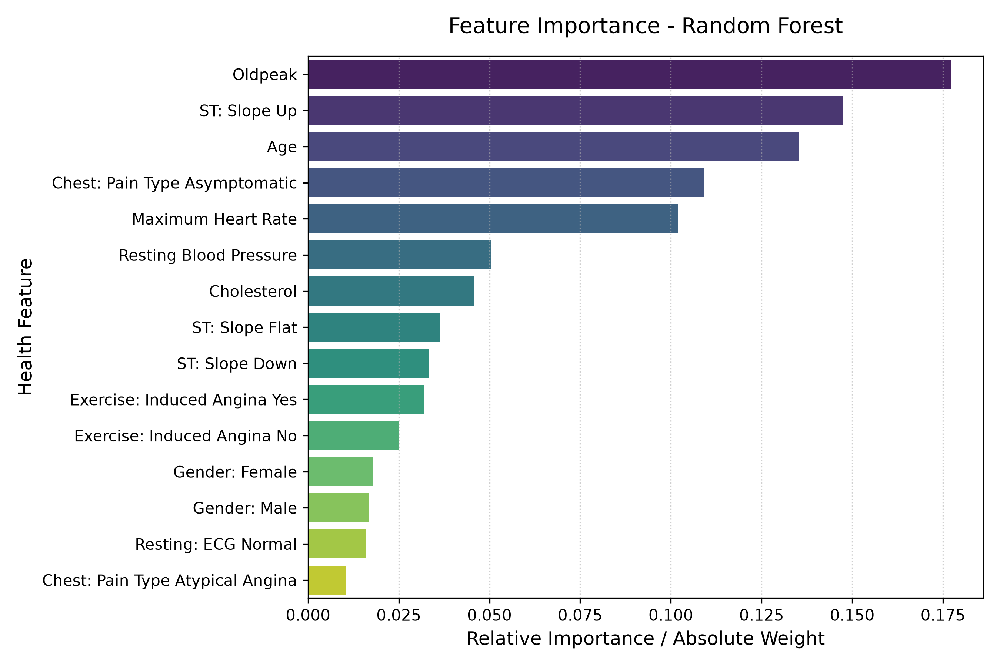

# CardioShield AI: Heart Disease Prediction ML Project

CardioShield AI is a complete, beginner-friendly Machine Learning project designed to analyze patient health parameters and predict the possibility of heart disease. The project implements a robust preprocessing pipeline, compares four distinct classifiers (Logistic Regression, Decision Tree, Random Forest, Support Vector Machine), and exports a production-grade inference engine served via a command-line interface and a premium interactive Streamlit dashboard.

---

## Folder Structure

```text
heart-disease-prediction-ml/
├── dataset/
│   └── heart_disease.csv                  # Generated patient clinical dataset
├── model/
│   └── heart_disease_model.pkl            # Pickled Scikit-learn best model pipeline
├── notebooks/
│   ├── analysis_training.ipynb            # Jupyter Notebook with EDA and model comparisons
│   └── images/                            # Saved visualization plots
│       ├── age_distribution.png
│       ├── cholesterol_distribution.png
│       ├── correlation_heatmap.png
│       ├── model_comparison.png
│       ├── random_forest_feature_importance.png
│       ├── support_vector_machine_confusion_matrix.png
│       └── support_vector_machine_roc_curve.png
├── src/
│   ├── generate_dataset.py                # Synthetic dataset generation tool
│   ├── train.py                           # Consolidating preprocessing, training, and evaluation
│   └── predict.py                         # CLI inference script
├── app.py                                 # Streamlit clinical interactive dashboard
├── requirements.txt                       # Core dependencies
├── README.md                              # Project documentation
└── .gitignore                             # Files to exclude from source control
```

---

## Features

1.  **Synthetic Dataset Generation**: Creates a realistic medical database of 1000+ patient records using a probability function mapping clinical risks (Age, Cholesterol, Blood Pressure, ST Slope) and randomizes ~3% missing values.
2.  **Reusable Preprocessing Pipeline**: Automatically imputes missing metrics (median/most-frequent), performs one-hot encoding for categories, scales numerical values, and splits datasets without data leakage.
3.  **Model Benchmarking**: Automatically fits and tests Logistic Regression, Decision Tree, Random Forest, and SVM models using standard metrics (Accuracy, Precision, Recall, F1, ROC-AUC) and saves the best model.
4.  **Premium Streamlit Dashboard**: Dynamic medical UI that evaluates patient metrics side-by-side, reports cardiovascular risk levels (Low/Moderate/High), shows alerts for clinical abnormalities, and renders feature weights.
5.  **Robust CLI Utility**: Predicts heart disease directly from command line arguments or interactive inputs.

---

## Technologies Used

*   **Python 3.12+**
*   **Pandas** & **NumPy** (Data manipulation)
*   **Matplotlib** & **Seaborn** (Visualization charts)
*   **Scikit-Learn** (Preprocessing & ML algorithms)
*   **Joblib** (Model serialization)
*   **Streamlit** (Web application dashboard)
*   **Jupyter Notebook** (EDA & interactive training)

---

## Installation Guide

### 1. Clone the Repository
Open a terminal and navigate to the project directory:
```bash
cd heart-disease-prediction-ml
```

### 2. Virtual Environment Setup
It is highly recommended to isolate project dependencies inside a virtual environment.

**On Windows:**
```powershell
python -m venv venv
.\venv\Scripts\activate
```

**On macOS / Linux:**
```bash
python3 -m venv venv
source venv/bin/activate
```

### 3. Install Dependencies
Install all required libraries listed in `requirements.txt`:
```bash
pip install -r requirements.txt
```

---

## How to Run the Project

Follow these steps sequentially to generate the data, train the models, and run the applications.

### Step 1: Generate the Dataset
Create the synthetic patient database with medical correlations and missing values:
```bash
python src/generate_dataset.py
```
*Outputs dataset to:* `dataset/heart_disease.csv`

### Step 2: Train the Model & Compare Classifiers
Run benchmarking across the models, output performance metrics to the console, select the best model (SVM), and generate all comparison plots:
```bash
python src/train.py
```
*Outputs model to:* `model/heart_disease_model.pkl`  
*Outputs plots to:* `notebooks/images/`

### Step 3: Run Command Line Predictions
You can use `predict.py` in two different modes.

**Argument Mode:**
Provide patient metrics directly as flags:
```bash
python src/predict.py --age 65 --gender Male --cp 3 --chol 280 --bp 170 --maxhr 110 --exang Yes --oldpeak 3.5 --slope 1
```

**Interactive Mode:**
If you run without arguments, the script will guide you step-by-step:
```bash
python src/predict.py
```

### Step 4: Run the Streamlit Web Application
Launch the professional clinical dashboard in your web browser:
```bash
streamlit run app.py
```
The app will open automatically at `http://localhost:8501`.

---

## Exploratory Data Analysis & Notebook
To inspect visual distributions and train models cell-by-cell, run the Jupyter notebook:
```bash
jupyter notebook notebooks/analysis_training.ipynb
```

---

## Screenshots Section

### 1. Model Comparison Metrics


### 2. Random Forest Feature Importances


---

## Future Improvements

*   **Hyperparameter Tuning**: Add Grid Search or Random Search cross-validation to optimize hyperparameters for classifiers.
*   **SHAP Explainability**: Integrate SHAP (SHapley Additive exPlanations) values to provide patient-specific feature importance for the SVM model.
*   **Patient Database Integration**: Connect to an SQLite or PostgreSQL database to save patient records and predictive diagnostics history.

---

## License

This project is open-source and licensed under the **MIT License**.
